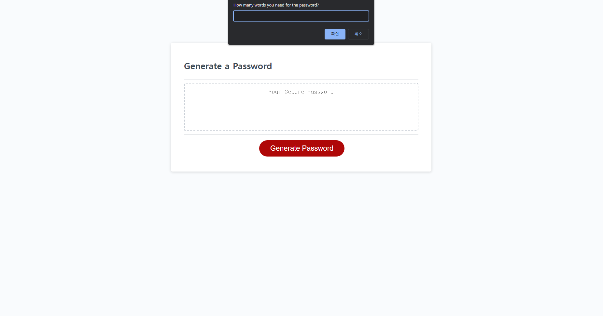

# password-Generator

## Description

It is more like Algorithm practice

This is the first project I've done after learning about the JavaScript

I used the if and for loop to make the program work properly 

Also used the prompt and comfirm for the interaction with the user 

## User Story 

```
AS AN employee with access to sensitive data
I WANT to randomly generate a password that meets certain criteria
SO THAT I can create a strong password that provides greater security
```

## Acceptance Criteria

```
GIVEN I need a new, secure password
WHEN I click the button to generate a password
THEN I am presented with a series of prompts for password criteria
WHEN prompted for password criteria
THEN I select which criteria to include in the password
WHEN prompted for the length of the password
THEN I choose a length of at least 8 characters and no more than 128 characters
WHEN asked for character types to include in the password
THEN I confirm whether or not to include lowercase, uppercase, numeric, and/or special characters
WHEN I answer each prompt
THEN my input should be validated and at least one character type should be selected
WHEN all prompts are answered
THEN a password is generated that matches the selected criteria
WHEN the password is generated
THEN the password is either displayed in an alert or written to the page
```

## Languages

English

HTML, CSS, & JavaScript

## Usage

To generate random password with the criteria that user wants. 

Such as length, number, alphabet, upper, lower, and some special symbols.

People can generate the password that they want but the selection of page alart. 

## App Screenshot


## Live website



## Contact

Linkedin: https://www.linkedin.com/in/sangmi-yun-0a4241201/